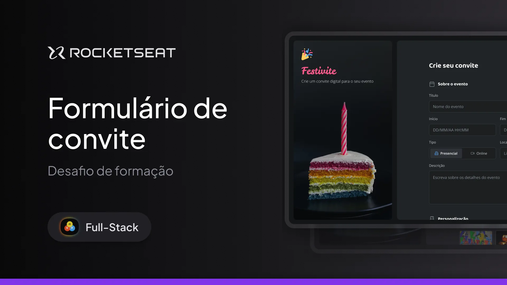

<h1 align="center">Formulário de Convite</h1>

Este projeto é um desafio do curso Fullstack da Rocketseat. Ele explora a criação de formulários em HTML, abordando os conceitos de:

- Formulários HTML;
- Input de data;
- Input de texto;
- Radio;
- Estilização de inputs com CSS;
- Estilização de formulários CSS.

  <a href="#-tecnologias">Tecnologias</a>&nbsp;&nbsp;&nbsp;|&nbsp;&nbsp;&nbsp;
  <a href="#-projeto">Projeto</a>&nbsp;&nbsp;&nbsp;|&nbsp;&nbsp;&nbsp;
  <a href="#memo-licença">Licença</a>

  

 

  

## 🚀 Tecnologias

Este projeto foi desenvolvido com as seguintes tecnologias:

- HTML e CSS  
- Git e GitHub  
- Figma

## 💻 Projeto

O formulário de convite permite a escolha dos detalhes de customização para um convite.

- [Acesse o projeto finalizado online](https://dev-filipebcs.github.io/invite-form/)
  
## :memo: Licença

Este projeto está sob a licença MIT.
